<textarea id="source">

<h1 class="slide-header">The Command Line Interface</h1>

30 mins

In this lesson you'll learn how to use the CLI (Command Line Interface) to read, create, and remove files and directories on your computer.

<h5 id="topics-header" class="color-grey-500">Topics</h5>

Command Line Interface

Mac, Linux, and Windows Users

Basic CLI Commands

<a href="./assets/the_command_line_interface_study_guide.pdf" target="_blank" download="the_command_line_interface_study_guide.pdf" class="ant-btn" data-trackable="true" data-track-category="study guide" data-track-section="lesson page" data-track-action="download study guide"><svg viewBox="0 0 16 16" width="1em" height="1em" fill="currentColor" aria-hidden="true" focusable="false" class=""><g class="download_svg__nc-icon-wrapper"><path d="M8 12c.3 0 .5-.1.7-.3L14.4 6 13 4.6l-4 4V0H7v8.6l-4-4L1.6 6l5.7 5.7c.2.2.4.3.7.3z"></path><path data-color="color-2" d="M1 14h14v2H1z"></path></g></svg> Download Study Guide</a>

---

<h1 class="slide-header">Learning Objectives</h1>

By the end of this lesson, you'll be able to:

<ul>
  <li>Explain the command line and why developers use it. </li>
  <li>Navigate through your computer’s files structure via the CLI.</li>
  <li>Create and remove files and directories via the CLI.</li>
</ul>

---

<h1 class="slide-header">GUIs</h1>

Most people use a **graphical user interface (GUI)** to find files on their computer.  
A GUI uses windows, icons, and menus that you can click with a mouse.

For example:

- On a Mac, you might click the **Finder** icon.
- On a Windows computer, you might open **File Explorer**.

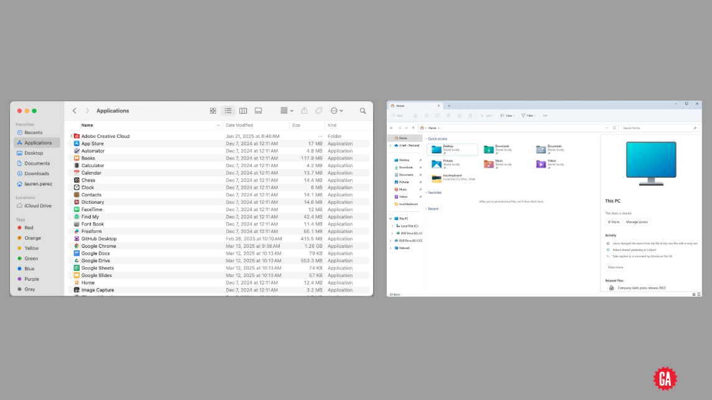

---

<h1 class="slide-header">What is the Command Line?</h1>

While GUIs are common, developers often use a tool called the **command line interface (CLI)**.

The command line lets you **type instructions** to your computer instead of clicking.  
It can be faster, more powerful, and lets you do things that are not always possible through a GUI.

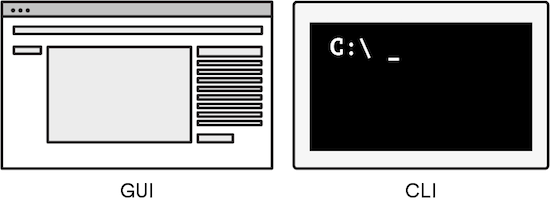

---

<h1 class="slide-header">How the Command Line Works</h1>

Before computers had screens, the **command line** was the only way to give instructions.  
Users typed commands, and the computer responded with text.

Today, developers still use the **command line interface (CLI)** because it is:

- **Clear** — you tell the computer exactly what to do.
- **Fast** — you can complete tasks quickly by typing.
- **Flexible** — it allows you to do many actions that are not always possible through clicking menus.

You use the CLI by **typing commands**.  
There are commands for almost everything: opening programs, creating or deleting files, and organizing folders.

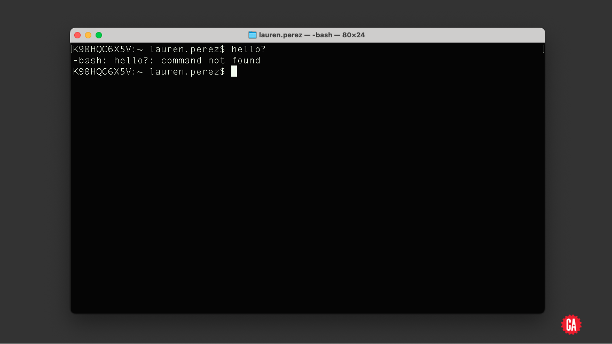

---

<h1 class="slide-header">What to Expect Next</h1>

For the rest of this lesson, we will show you some of the most common commands that developers use in the terminal.

We encourage you to **follow along and try the commands yourself**. This will help you learn by doing.

Here is a helpful tip:

- On a **Mac**, use the shortcut `command + tab`
- On **Windows**, use the shortcut `alt + tab`

This lets you quickly switch between your web browser (where you are reading this lesson) and your command line window.

---

<h1 class="slide-header">Accessing the Command Line</h1>

We use the command line through a program called a **terminal application**.  
The terminal is where you will type your commands, and it sends those commands to the **shell**, which processes and runs them.

**How to open the terminal:**

- **On a Mac**:  
  Press `command + space` to open Spotlight search.  
  Type **Terminal** and press `return`.

 

- **On Windows**:  
  We will use a tool called **Git Bash**, which gives Windows users a terminal similar to what Mac and Linux users have.  
  First, check if you already have Git Bash:

  - Open the Start menu.
  - Type **Git Bash** into the search bar and open the application.

  If you do not have it yet:

  - Go to the <a href="https://git-scm.com/downloads" target="_blank" rel="noreferrer noopener">Git website</a>.
  - Click **Windows** and follow the instructions to download and install Git Bash.

  Once installed, you can open Git Bash anytime from your Start menu.

---

<h1 class="slide-header">Home Directory</h1>

In programming, folders are called **directories**.

- A directory inside another directory is called a **subdirectory**.
- A directory that contains other directories is called a **parent directory**.

When you open the terminal, it starts in a special place called the **home directory**. This is the main starting point in your computer’s file structure.

Here is where your home directory is located, depending on your operating system:

- On **Mac**, it is `/Users/yourname/`
- On **Windows**, it is `C:\Users\yourname` (if you are using Git Bash, it will show this in a slightly different format)
- On **Linux**, it is `/home/yourname`

This is what the terminal might look like when you first open it (on a Mac):

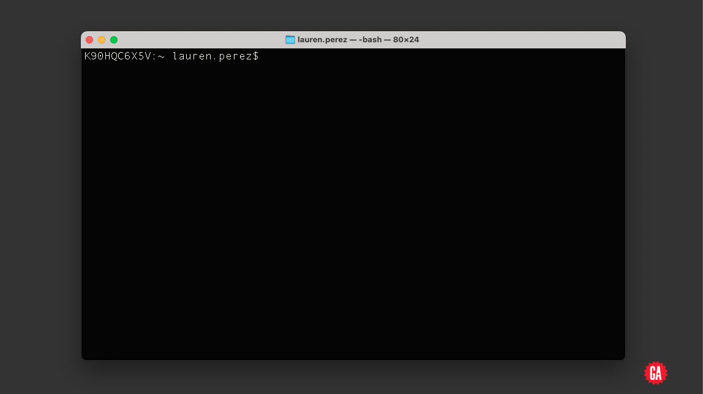

---

<h1 class="slide-header">Understanding the Terminal Window</h1>

The terminal window is where you will type commands, and where the computer will show its responses.

If this is your first time seeing this window, let’s look at what each part means:

- The **prompt** is the symbol (often a **`$`**) that appears at the beginning of a line. It shows that the terminal is ready for your next command.
- The **cursor** appears after the prompt. This is where the text you type will show up, just like a blinking cursor in other programs.
- The **username** (your computer username) often appears before the prompt, showing who is logged in.

Here’s an example of what the terminal might look like:

---

<h1 class="slide-header">Testing...</h1>
<!--
  WISTIA EXAMPLE. REPLACE 11dit621rx with the id
-->

  

    

      
 

      

        

          

            <video id="wistia_simple_video_135" crossorigin="anonymous"
              poster="https://fast.wistia.com/assets/images/blank.gif" aria-label="Video" controlslist="nodownload"
              playsinline="" preload="auto" type="video/m3u8" x-webkit-airplay="allow"
              style="background: transparent; display: block; height: 100%; max-height: none; max-width: none; position: static; visibility: visible; width: 100%; object-fit: contain;"></video>
          

          

            

              

                

                
<button
                    aria-label="Play Video: A Brief History of the Web" class="w-css-reset w-vulcan-v2-button"
                    tabindex="0" style="width: 0px; height: 0px; pointer-events: none;"></button>

              

              

              

                

                  

                

                

                  

                    

                      

                        <button class="w-big-play-button w-css-reset-button-important w-vulcan-v2-button" tabindex="0"
                          type="button" style="cursor: pointer; height: 78.75px; box-shadow: none; width: 123.047px;">
                          

                          

                          

                          
<svg x="0px" y="0px" viewBox="0 0 125 80" enable-background="new 0 0 125 80"
                            aria-hidden="true" alt=""
                            style="fill: rgb(255, 255, 255); height: 78.75px; left: 0px; stroke-width: 0px; top: 0px; width: 100%; position: absolute;">
                            <rect fill-rule="evenodd" clip-rule="evenodd" fill="none" width="125" height="80"></rect>
                            <polygon fill-rule="evenodd" clip-rule="evenodd" fill="#FFFFFF" points="53,22 53,58 79,40">
                            </polygon>
                          </svg>
                        </button>
                      

                    

                    

  

    <button aria-label="Click for sound" class="w-vulcan-v2-button click-for-sound-btn"
      style="background: rgba(0, 0, 0, 0.8); border: 2px solid transparent; border-radius: 60px; cursor: pointer; display: flex; justify-content: space-between; align-items: center; outline: none; pointer-events: auto; position: absolute; right: 20.1484px; top: 20.1484px; max-width: 589.703px;">
      

        Click
          for sound
      
<svg viewBox="0 0 237 237" width="51.6796875" height="51.6796875"></svg>
    </button>

                

              

            

          

        

      

    

  

<!-- YOUTUBE -->
<!-- VIMEO -->

  
Transcript

  
  

    Now that we’re up and running, let’s type some commands, shall we? In a terminal window, we type “hello?” and press enter.

    Terminal responds with: “-bash: hello?: command not found”.

    Translation: “I’m not following you.”

    Now, if we type “Where am I?” into the terminal (“$ Where am I?”), again we get a similar response: “-bash: Where: command not found”.

    OK, then. We’ve established that our command line doesn’t understand plain English. We’ll have to use special words to write our commands.

    Remember, we’ve left the GUI world behind. We no longer have pretty warning messages and alert boxes. But not to worry! In due time, these cryptic command line messages will be as clear as any warning box you’ll ever see.

  

---

<h1 class="slide-header">The <code>pwd</code> Command: Where Are You?</h1>

The command `pwd` stands for **print working directory**.  
You can think of it as asking the computer, **"Where am I right now?"**

When you open the terminal, you are placed in a certain directory on your computer.  
The `pwd` command tells you exactly where that location is in your file system.

**💻 In your terminal, type: `pwd`**
**Then press `Enter`**

If you were using a graphical interface, like **Finder** on a Mac or **File Explorer** on Windows, you would see the folder you are in.

In the terminal, you cannot see files and folders by default — you need to use specific commands to ask for that information. (We will learn that next!)

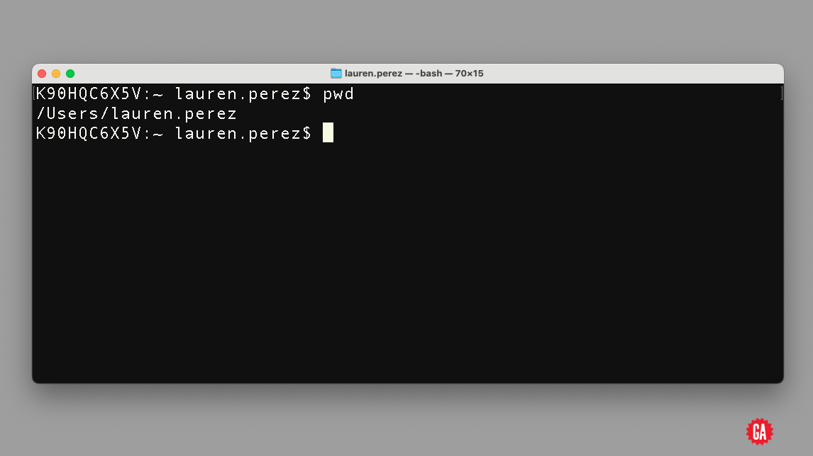

---

<h1 class="slide-header">The <code>ls</code> Command: Listing Files and Folders</h1>

To see which files and folders are in your current directory, use the command **`ls`**.  
`ls` stands for **list**, and it tells the terminal to show everything in your current location.

**💻 In your terminal, type: `ls`**
**Then press `Enter`**

You might see something like this:

**`Desktop` `Downloads` `Movies` `Pictures` `Documents` `Library` `Music` `Public`**

If you are using Windows with Git Bash, the results may look slightly different, but you will still see familiar folders like `Desktop`, `Documents`, and `Downloads`.

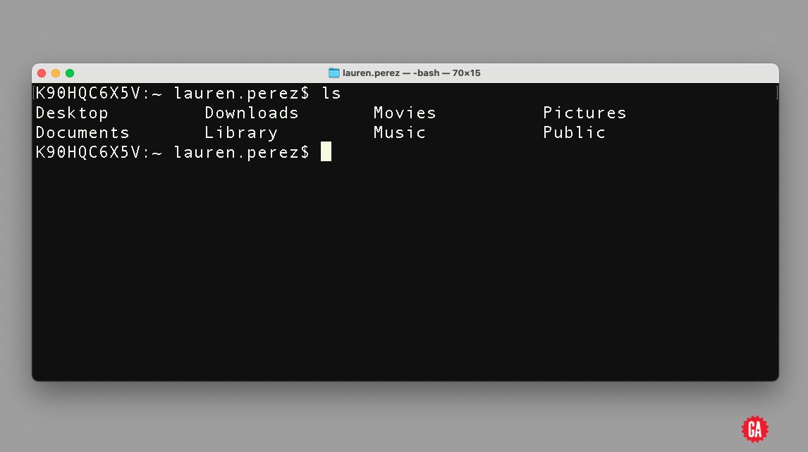

---

<h1 class="slide-header">The <code>cd</code> Command: Changing Directories</h1>

To move into a different directory, use the `cd` command.  
`cd` stands for **change directory**, followed by the name of the folder you want to go into.

**💻 In your terminal, type: `cd Documents`**
**Then press `Enter`**

Now, you are inside the `Documents` directory!

**💻 In your terminal, type: `ls`**
**Then press `Enter`**

This will give the contents of the `Documents` directory:

**`My Images` `My Work` `to-do-list.txt`**

In this example, the `Documents` directory contains:

- A folder called **My Images**
- A folder called **My Work**
- A file called **to-do-list.txt**

This is just an example — your folders and files will reflect what you have on your computer.

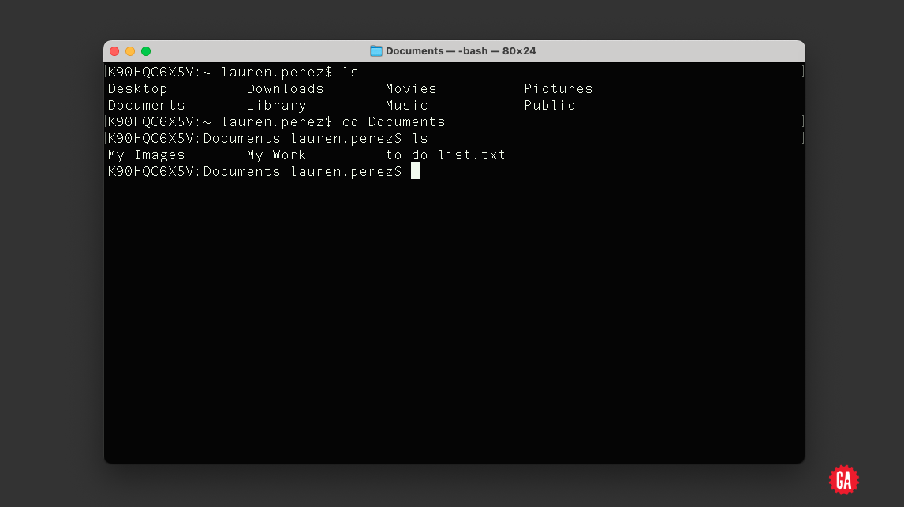

You can also check this in your computer’s GUI to confirm that it matches what you see in the terminal:

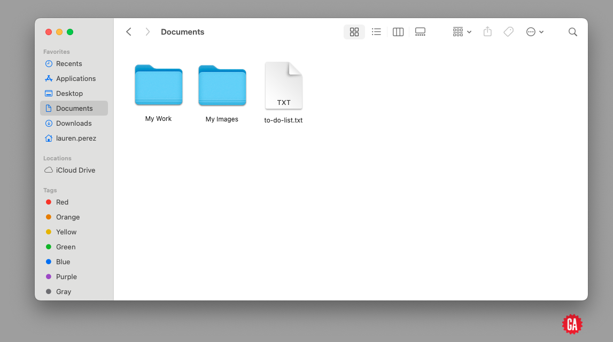

---

<h1 class="slide-header">Hidden Files and Flags</h1>

There are some files on your computer that are **hidden by default**. These hidden files are usually used by the operating system or applications, and most everyday users do not need to see them.

However, as a developer, you may need to view these hidden files.

You can do this by using something called a **flag**.  
A flag is an extra option you add to a command to change how it behaves.

Flags always start with a `-` (dash).

**💻 In your terminal, type: `ls -a`**
**Then press `Enter`**

This tells the terminal: _"List all files, including hidden ones."_  
Hidden files usually begin with a `.` (period).

When you run `ls -a`, your output may look something like this:

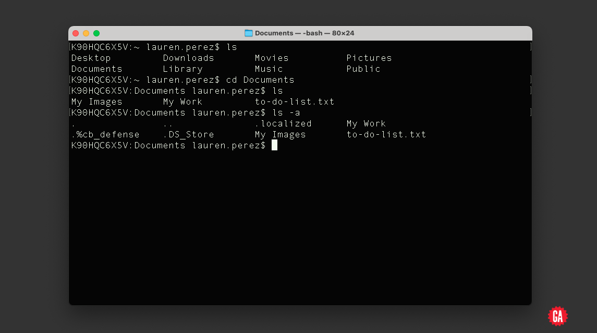

---

<h1 class="slide-header">Moving Up to the Parent Directory</h1>

If you want to leave the `Documents` folder and go back to the directory above it (the **parent directory**), use the command `cd ..`.

**💻 In your terminal, type: `cd ..`**
**Then press `Enter`**

The two dots (`..`) tell the terminal to move **up one level** in the file structure.

**💻 In your terminal, type: `pwd`**
**Then press `Enter`**

You should now be back in your home directory, which might look like `/Users/yourname` on a Mac or `C:\Users\yourname` on Windows (if using Git Bash).

If you are deeper in your file structure and want to quickly return to your home directory from anywhere, you can use this command:

**`cd ~`**

The tilde (`~`) is a shortcut that always brings you back to your **home** directory.

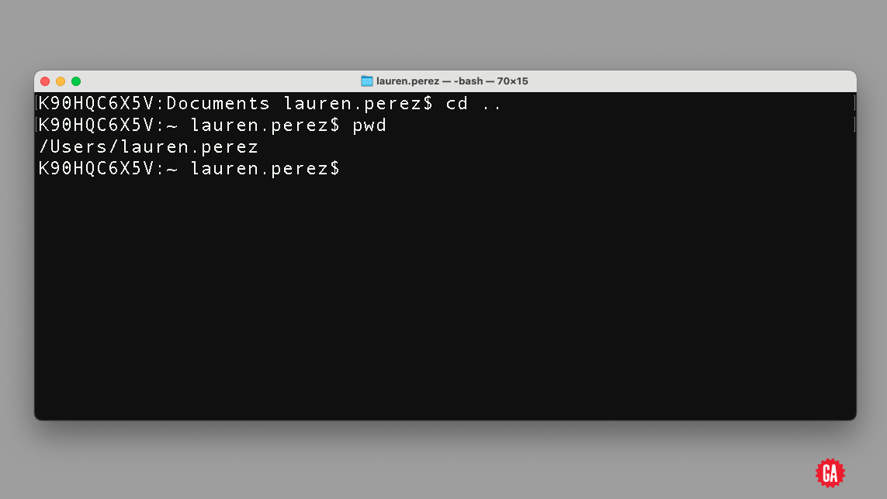

---

<h1 class="slide-header">Knowledge Check</h1>

How would you find out in which directory your terminal is actively located?

<fieldset>
    <legend>Please select one of the following</legend>
<input type='radio' name='answers' id='answer1' value='answer1' /><label for='answer1'>cd -a</label> 
<input type='radio' name='answers' id='answer2' value='answer2' /><label for='answer2'>ls ~</label> 
<input type='radio' name='answers' id='answer3' value='answer3' /><label for='answer3'>cwd</label> 
<input type='radio' name='answers' id='answer4' value='answer4' correct='true'/><label for='answer4'>pwd</label> 
</fieldset>
<button class='ant-btn ant-btn-primary multiple-choice-radio-submit'>Submit Answer</button>

---

<h1 class="slide-header">Creating a New Directory</h1>

To create a new folder (which we call a **directory**), use the `mkdir` command.  
For example, let's say we want to create a folder called `myfolder`.

**💻 In your terminal, type: `mkdir myfolder`**
**Then press `Enter`**

Now, if you type **`ls`** to list the contents of your current directory, you should see something like this:

**`Desktop` `Downloads` `Movies` `Pictures` `Documents` `Library` `Music` `Public` `myfolder`**

Notice that `myfolder` has been added to the list.

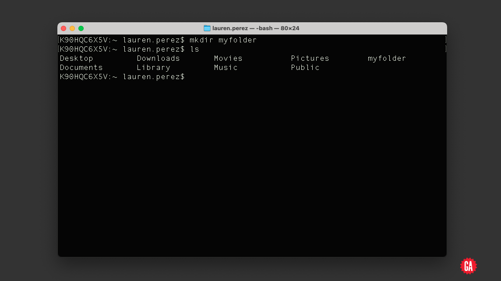

---

<h1 class="slide-header">Creating and Viewing Files</h1>

First, let’s move into the `myfolder` directory that we just created.

**💻 In your terminal, type: `cd myfolder`**
**Then press `Enter`**

Now we’re inside that folder.

Let’s create some new files. For example, if we want to start building a simple website, we can create an HTML file and a CSS file.

We do this using the `touch` command. The `touch` command creates new, empty files. You can even create multiple files at once by listing them with spaces.

**💻 In your terminal, type: `touch index.html style.css`**
**Then press `Enter`**

This will create two new files: `index.html` and `style.css`.

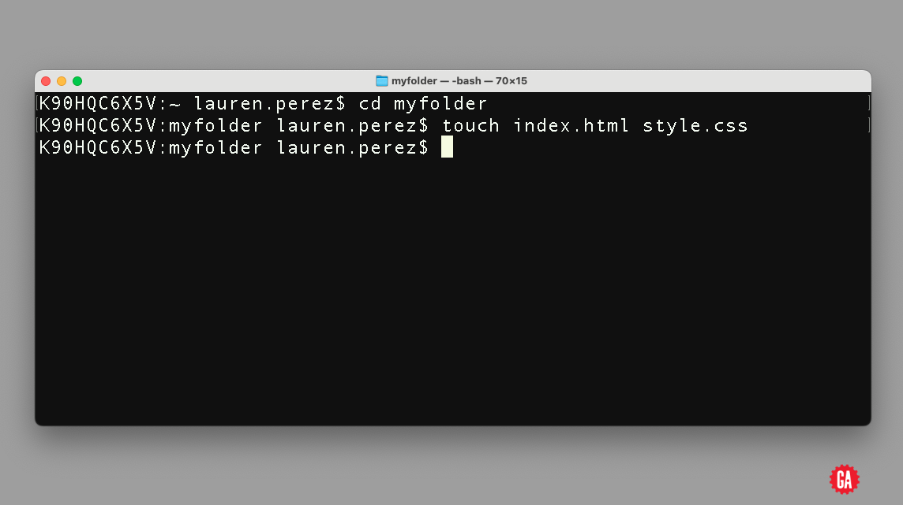

---

  

    

      
 

      

        

          

            <video id="wistia_simple_video_135" crossorigin="anonymous"
              poster="https://fast.wistia.com/assets/images/blank.gif" aria-label="Video" controlslist="nodownload"
              playsinline="" preload="auto" type="video/m3u8" x-webkit-airplay="allow"
              style="background: transparent; display: block; height: 100%; max-height: none; max-width: none; position: static; visibility: visible; width: 100%; object-fit: contain;"></video>
          

          

            

              

                

                
<button
                    aria-label="Play Video: A Brief History of the Web" class="w-css-reset w-vulcan-v2-button"
                    tabindex="0" style="width: 0px; height: 0px; pointer-events: none;"></button>

              

              

              

                

                  

                

                

                  

                    

                      

                        <button class="w-big-play-button w-css-reset-button-important w-vulcan-v2-button" tabindex="0"
                          type="button" style="cursor: pointer; height: 78.75px; box-shadow: none; width: 123.047px;">
                          

                          

                          

                          
<svg x="0px" y="0px" viewBox="0 0 125 80" enable-background="new 0 0 125 80"
                            aria-hidden="true" alt=""
                            style="fill: rgb(255, 255, 255); height: 78.75px; left: 0px; stroke-width: 0px; top: 0px; width: 100%; position: absolute;">
                            <rect fill-rule="evenodd" clip-rule="evenodd" fill="none" width="125" height="80"></rect>
                            <polygon fill-rule="evenodd" clip-rule="evenodd" fill="#FFFFFF" points="53,22 53,58 79,40">
                            </polygon>
                          </svg>
                        </button>
                      

                    

                    

  

    <button aria-label="Click for sound" class="w-vulcan-v2-button click-for-sound-btn"
      style="background: rgba(0, 0, 0, 0.8); border: 2px solid transparent; border-radius: 60px; cursor: pointer; display: flex; justify-content: space-between; align-items: center; outline: none; pointer-events: auto; position: absolute; right: 20.1484px; top: 20.1484px; max-width: 589.703px;">
      

        Click
          for sound
      
<svg viewBox="0 0 237 237" width="51.6796875" height="51.6796875"></svg>
    </button>

                

              

            

          

        

      

    

  

<!-- YOUTUBE -->
<!-- VIMEO -->

  
Transcript

  
  

    We’ve learned a lot of command line… commands.

Let’s compare what happens in the GUI (Finder on Mac) when we use some of the most common commands in Terminal.

To illustrate this, we’ve set up our Finder and Terminal side by side. If you’re a PC user, it might look a little different, but the results will be the same!

Let’s cd into the Documents folder.

The terminal returns “macBook-Pro-(8): documents EmilyLogan$”, which means, “Hey, you’ve moved into the Documents folder as the user EmilyLogan.” This will say your username, not mine.

If we wanted to achieve the same thing in the Finder, we’d just click on the Documents folder.

In the GUI, you can see what files and folders exist in the Documents directory — the zoom folder.

To do this in Terminal, we use the ls command.

Next, let’s make a folder called “myfolder”.

Oh wow, look what happened in Finder! “myfolder” was created in the Documents folder.

We’ll cd into “myfolder” in Terminal, which, again, is the same thing as double-clicking into “myfolder” in the Finder.

Now, let’s make some files. In Terminal, we type “touch”, “index.html”, and “style.css”.

Instantaneously, we see our two new files appear in Finder.

To see these files in Terminal, we’ll use the list command again, which returns the names of the files we just created.

We can remove the “style.css” by using the `rm` command and see that it was in fact deleted by using the list command.

Now, we can move out of “myfolder” and back into Documents with “cd ..”. This equates to clicking the back arrow to take us back to the folder we were just in: Documents.

Terminal tells us where we are by returning “macBook-Pro-(8): documents EmilyLogan$”.

  

---

<h1 class="slide-header">Removing Files</h1>

Now that we’ve created some files, let’s learn how to remove one.

To delete a file, we use the `rm` command, followed by the name of the file.

**💻 In your terminal, type: `rm style.css`**
**Then press `Enter`**

⚠️ **Important:** Be very careful when using `rm`. Deleting a file with `rm` is permanent — it does not go to the trash or recycle bin, and you cannot undo it.

After deleting the file, you verify by checking the contents of the folder.

**💻 In your terminal, type: `ls`**
**Then press `Enter`**

You should now only see `index.html` remaining.

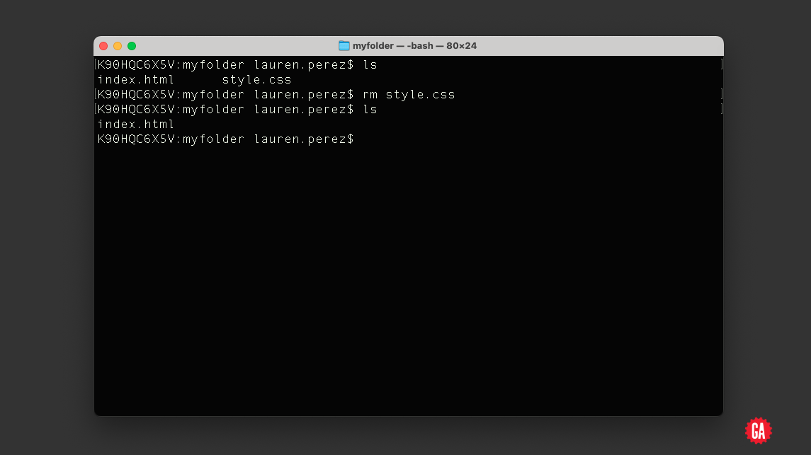

---

<h1 class="slide-header">Knowledge Check</h1>

Assuming `Documents` is a directory located within the working directory of the terminal, what does the command `ls -a Documents` do?

<fieldset>
    <legend>Please select one of the following</legend>
<input type='radio' name='answers' id='answer2' value='answer2' /><label for='answer2'>Changes into the Documents directory and lists all contents</label> 
<input type='radio' name='answers' id='answer3' value='answer3' /><label for='answer3'>Remains in the current directory and lists all contents of the Documents directory</label> 
<input type='radio' name='answers' id='answer4' value='answer4' correct="true"/><label for='answer4'>Remains in the current directory and lists only the non-hidden contents of the Documents directory</label> 
<input type='radio' name='answers' id='answer5' value='answer5' /><label for='answer5'>Changes into the Documents directory and lists its non-hidden contents</label> 
</fieldset>
<button class='ant-btn ant-btn-primary multiple-choice-radio-submit'>Submit Answer</button>

---

<h1 class="slide-header">Test Yourself!</h1>

Now it’s your turn to practice using the command line!

We’ve created a directory for you called `world`. You can download it <a href="./assets/World.zip" download>here</a>.

After you download and double-click the zip file, it will create a folder called `world` in your `Downloads` directory.

**Here’s what to do next:**

1. Open a terminal window.
2. Use the command line to navigate to your `Downloads` directory.
   - **For Mac:** `cd ~/Downloads`
   - **For Windows (Git Bash):** `cd /c/Users/YourUsername/Downloads` (replace `YourUsername` with your Windows username)
3. Move into the `world` directory from there.
4. Use `ls` to list the contents of the `world` directory.
5. Inside one of the six continent folders, there is a **_hidden_** file called `.carmen_sandiego.png`.

Using **only the command line**, find out where this hidden file is located in the directory structure.

**Hint:** Remember the `-a` flag to see hidden files, and think about how to search through directories step by step!

---

<h1 class="slide-header">Finding Carmen</h1>

Did you manage to find Carmen Sandiego?

The hidden file **`.carmen_sandiego.png`** was located in the **Europe** folder.

If you didn’t find it, don’t worry!

Make sure to use the command:

**`ls -a`**

The `-a` flag shows hidden files that start with a period (`.`). Without this flag, those files will not appear in your list.

---

<h1 class="slide-header">Conclusion</h1>

In this lesson, you learned how to access your computer’s **command line interface (CLI)** and use it to navigate through your files and folders.

The CLI is a powerful tool. Just like power tools, it should be used carefully.  
When you type a command, you are giving direct instructions to your computer — and some commands can make big changes.

As long as you follow the instructions provided in this pre-work or in class, you will be safe and build confidence using the command line.

With practice, the CLI will become an important tool in your developer toolkit!

</textarea>
